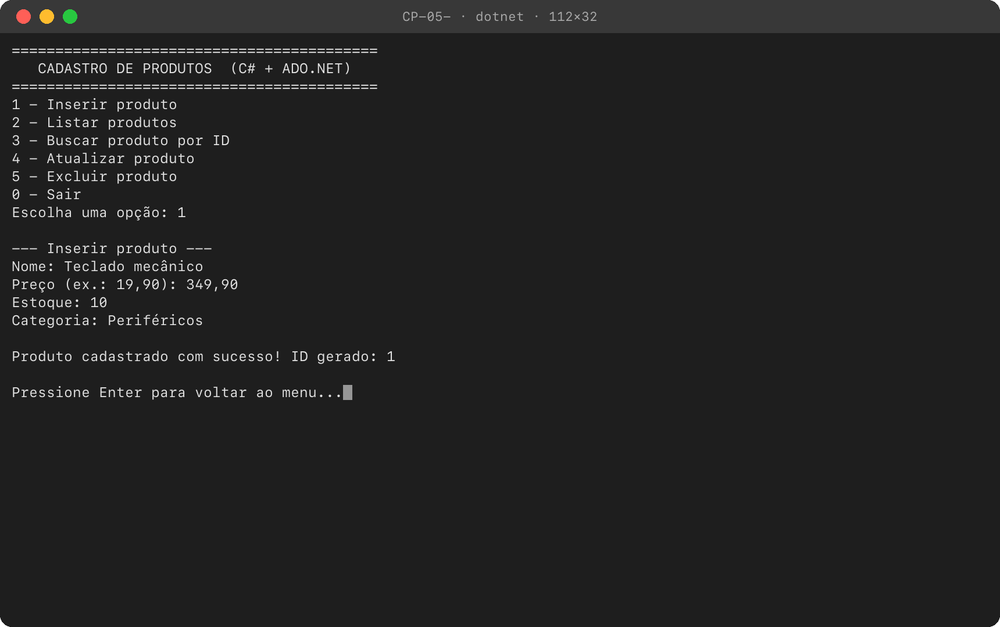
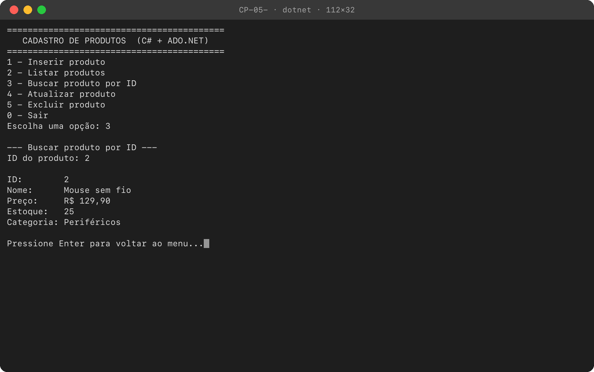
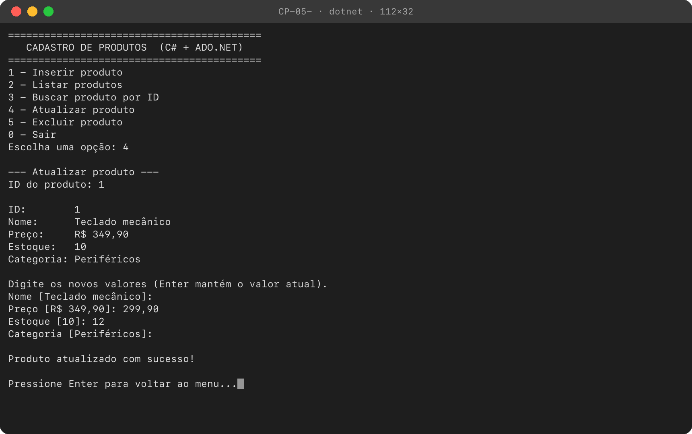
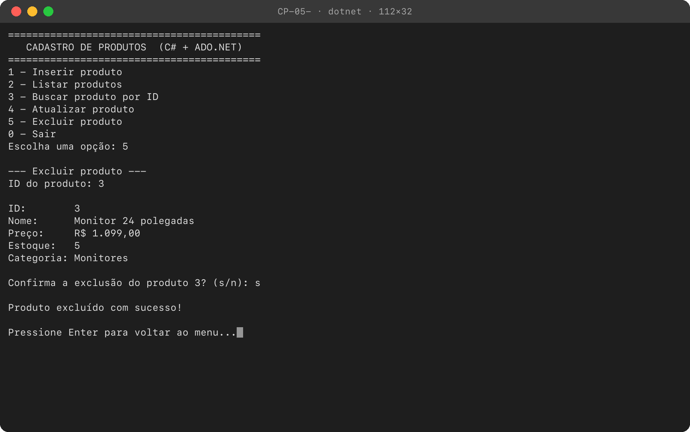
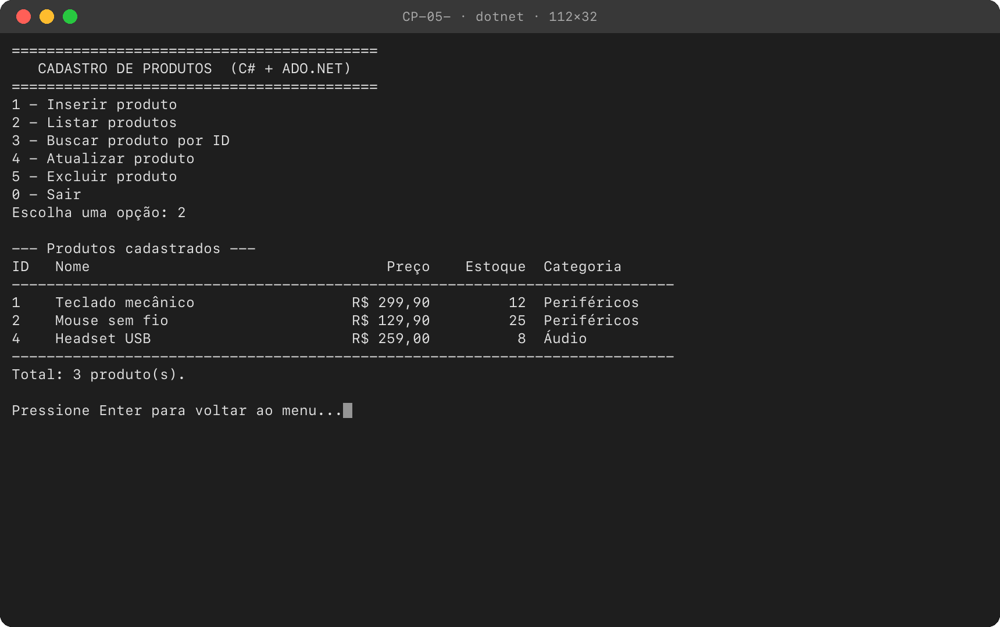
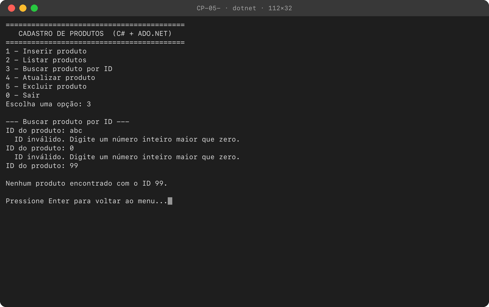
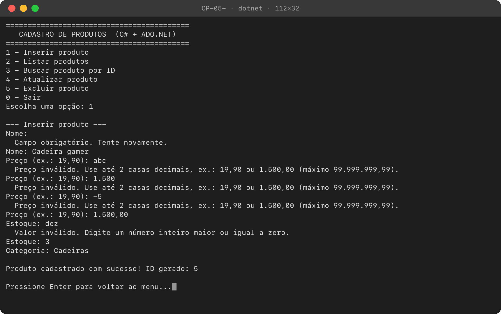
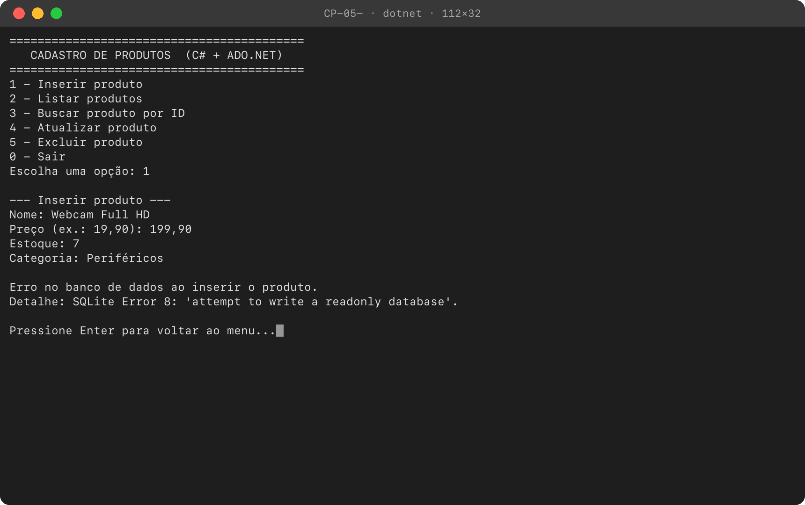
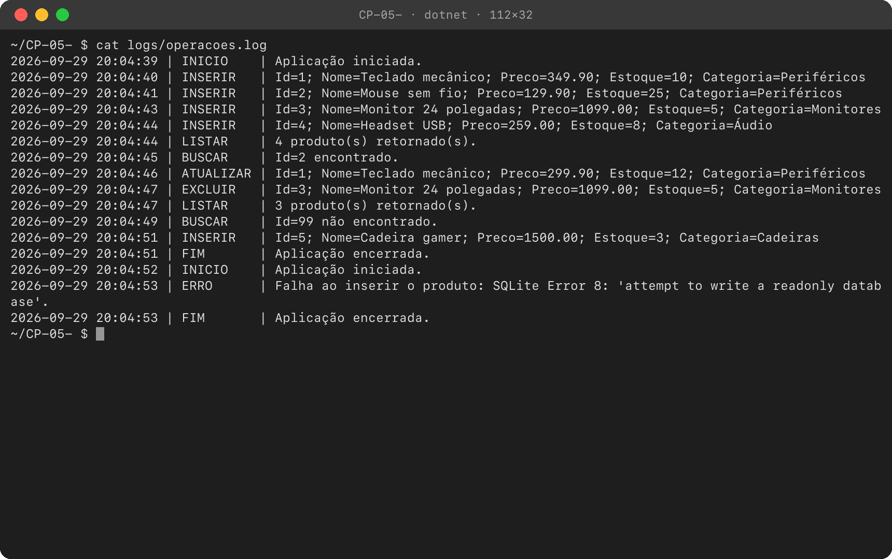

# CRUD de Produtos com C# e ADO.NET

Aplicação de console em C# que faz o cadastro de produtos (inserir, listar, buscar por ID,
atualizar e excluir) usando **ADO.NET puro**, sem ORM, com banco **SQLite**.

## Tecnologias

- .NET 8 (C#)
- ADO.NET com `Microsoft.Data.Sqlite` (`SqliteConnection`, `SqliteCommand`, `SqliteDataReader`)
- SQLite: o banco é um arquivo, não precisa instalar servidor
- `Microsoft.Extensions.Configuration.Json` para ler o `appsettings.json`
- xUnit para os testes

## Estrutura

```
├── CrudProdutos.sln
├── database/
│   └── criar-tabela-produto.sql    # script de criação da tabela Produto
├── docs/prints/                    # prints das operações funcionando
├── src/CrudProdutos/
│   ├── appsettings.json            # connection string e caminho do arquivo de log
│   ├── Program.cs                  # lê a configuração, prepara o banco e abre o menu
│   ├── Models/Produto.cs           # classe Produto
│   ├── Data/ProdutoRepository.cs   # acesso ao banco: Inserir, Listar, BuscarPorId, Atualizar, Excluir
│   ├── Data/BancoDeDados.cs        # executa o script .sql ao iniciar
│   ├── Infra/LogDeOperacoes.cs     # grava as operações em arquivo
│   └── UI/MenuConsole.cs           # interface de console: menu, leitura e validação
└── tests/CrudProdutos.Tests/       # testes do ProdutoRepository
```

## Como configurar e executar

### Pré-requisitos

- [.NET SDK 8](https://dotnet.microsoft.com/download) ou mais novo (confira com `dotnet --version`).
- Git, para clonar. Sem Git, dá para baixar o ZIP pelo botão **Code** do GitHub.
- Para abrir pelo Visual Studio: Visual Studio 2022 versão 17.8 ou mais nova.

Não é preciso instalar banco de dados: o SQLite vem no pacote NuGet e o arquivo `produtos.db`
é criado na primeira execução.

### Pelo terminal

```bash
git clone https://github.com/jota0802/CP-05-.git
cd CP-05-
dotnet run --project src/CrudProdutos
```

O `produtos.db` e a pasta `logs/` são criados na pasta de onde o comando é executado (aqui, a
raiz do repositório).

### Pelo Visual Studio

Abra o `CrudProdutos.sln`, defina `CrudProdutos` como projeto de inicialização e pressione F5.
Nesse caso o `produtos.db` e o `logs/operacoes.log` ficam em `src/CrudProdutos/bin/Debug/net8.0/`.

### Banco de dados

A connection string fica em [`src/CrudProdutos/appsettings.json`](src/CrudProdutos/appsettings.json):

```json
{
  "ConnectionStrings": {
    "DefaultConnection": "Data Source=produtos.db"
  },
  "Log": {
    "Arquivo": "logs/operacoes.log"
  }
}
```

- Ao iniciar, a aplicação executa o script [`database/criar-tabela-produto.sql`](database/criar-tabela-produto.sql).
  Como ele usa `CREATE TABLE IF NOT EXISTS`, a tabela é criada na primeira vez e os dados são
  mantidos nas execuções seguintes.
- Para usar outro arquivo de banco, troque o `Data Source` da `DefaultConnection`.
- Criar o banco manualmente é opcional e exige o [sqlite3](https://sqlite.org/download.html) de linha de comando.
  Este comando funciona no bash, no cmd e no PowerShell:
  `sqlite3 produtos.db ".read database/criar-tabela-produto.sql"`

Tabela `Produto`:

| Coluna    | Tipo          | Regra                           |
|-----------|---------------|---------------------------------|
| Id        | INTEGER       | chave primária, autoincremento  |
| Nome      | TEXT          | obrigatório                     |
| Preco     | DECIMAL(10,2) | obrigatório, maior ou igual a 0 |
| Estoque   | INTEGER       | obrigatório, maior ou igual a 0 |
| Categoria | TEXT          | obrigatório                     |

### Testes

```bash
dotnet test
```

São 9 testes do `ProdutoRepository`. Cada um cria um banco SQLite temporário com o mesmo script
`.sql` da aplicação. Juntos, eles cobrem inserir, listar, buscar, atualizar, excluir, o caso de ID
inexistente, um texto com SQL injection gravado como dado comum e a regra `CHECK` do banco
rejeitando preço negativo.

## Menu

```
1 - Inserir produto
2 - Listar produtos
3 - Buscar produto por ID
4 - Atualizar produto
5 - Excluir produto
0 - Sair
```

- No **Atualizar**, apertar Enter mantém o valor atual do campo.
- O **Excluir** mostra o produto e pede confirmação.
- O preço aceita vírgula ou ponto nos centavos (`19,90` ou `19.90`) e ponto de milhar junto com a
  vírgula (`1.500,00`). Um valor ambíguo como `1.500` é recusado, para não virar R$ 1,50.
- Entrada inválida (campo vazio, texto no lugar de número, valor negativo) mostra uma mensagem e
  pede o valor de novo.

## Requisitos técnicos: onde cada um está

| Requisito | Onde |
|---|---|
| SQLite | pacote `Microsoft.Data.Sqlite` no [`CrudProdutos.csproj`](src/CrudProdutos/CrudProdutos.csproj) |
| Script `.sql` da tabela | [`database/criar-tabela-produto.sql`](database/criar-tabela-produto.sql) |
| Connection string no `appsettings.json` | [`appsettings.json`](src/CrudProdutos/appsettings.json), lida no [`Program.cs`](src/CrudProdutos/Program.cs) |
| Classe `Produto` | [`Models/Produto.cs`](src/CrudProdutos/Models/Produto.cs) |
| Classe `ProdutoRepository` | [`Data/ProdutoRepository.cs`](src/CrudProdutos/Data/ProdutoRepository.cs) |
| Métodos `Inserir`, `Listar`, `BuscarPorId`, `Atualizar` e `Excluir` | `ProdutoRepository` |
| `ExecuteNonQuery` no INSERT, UPDATE e DELETE | `Inserir`, `Atualizar` e `Excluir` |
| `ExecuteReader` nos SELECT | `Listar`, `BuscarPorId` e a leitura do ID gerado no `Inserir` |
| Mapeamento manual do DataReader para `Produto` | método `Mapear` do `ProdutoRepository` |
| SQL parametrizado | todo comando que recebe valor usa parâmetros (`@Id`, `@Nome`, `@Preco`, `@Estoque`, `@Categoria`); o `Listar` e o `SELECT last_insert_rowid()` não recebem valor |
| Tratamento de exceções do banco | `MenuConsole.ExecutarOperacao` captura `DbException`, mostra a mensagem, registra no log e volta ao menu; o `Program.cs` trata as falhas ao ler a configuração e ao preparar o banco |
| Registro das operações em arquivo | [`Infra/LogDeOperacoes.cs`](src/CrudProdutos/Infra/LogDeOperacoes.cs), gravando em `logs/operacoes.log` |
| Separação entre interface e Repository | [`UI/MenuConsole.cs`](src/CrudProdutos/UI/MenuConsole.cs) não tem SQL; o `ProdutoRepository` não usa o console |

## Log de operações

Cada operação vira uma linha em `logs/operacoes.log`. Este é o log da sessão dos prints abaixo:

```
2026-09-29 20:04:39 | INICIO    | Aplicação iniciada.
2026-09-29 20:04:40 | INSERIR   | Id=1; Nome=Teclado mecânico; Preco=349.90; Estoque=10; Categoria=Periféricos
2026-09-29 20:04:41 | INSERIR   | Id=2; Nome=Mouse sem fio; Preco=129.90; Estoque=25; Categoria=Periféricos
2026-09-29 20:04:43 | INSERIR   | Id=3; Nome=Monitor 24 polegadas; Preco=1099.00; Estoque=5; Categoria=Monitores
2026-09-29 20:04:44 | INSERIR   | Id=4; Nome=Headset USB; Preco=259.00; Estoque=8; Categoria=Áudio
2026-09-29 20:04:44 | LISTAR    | 4 produto(s) retornado(s).
2026-09-29 20:04:45 | BUSCAR    | Id=2 encontrado.
2026-09-29 20:04:46 | ATUALIZAR | Id=1; Nome=Teclado mecânico; Preco=299.90; Estoque=12; Categoria=Periféricos
2026-09-29 20:04:47 | EXCLUIR   | Id=3; Nome=Monitor 24 polegadas; Preco=1099.00; Estoque=5; Categoria=Monitores
2026-09-29 20:04:47 | LISTAR    | 3 produto(s) retornado(s).
2026-09-29 20:04:49 | BUSCAR    | Id=99 não encontrado.
2026-09-29 20:04:51 | INSERIR   | Id=5; Nome=Cadeira gamer; Preco=1500.00; Estoque=3; Categoria=Cadeiras
2026-09-29 20:04:51 | FIM       | Aplicação encerrada.
2026-09-29 20:04:52 | INICIO    | Aplicação iniciada.
2026-09-29 20:04:53 | ERRO      | Falha ao inserir o produto: SQLite Error 8: 'attempt to write a readonly database'.
2026-09-29 20:04:53 | FIM       | Aplicação encerrada.
```

## Prints

### Inserir produto



### Listar produtos


### Buscar produto por ID



### Atualizar produto



### Excluir produto



### Listagem depois de atualizar e excluir



### Tratamento de erros

ID inválido e ID que não existe:



Validação da entrada ao inserir:



Erro do banco de dados (arquivo `produtos.db` somente leitura): a exceção é tratada, registrada no
log e o menu continua funcionando.



### Log de operações


